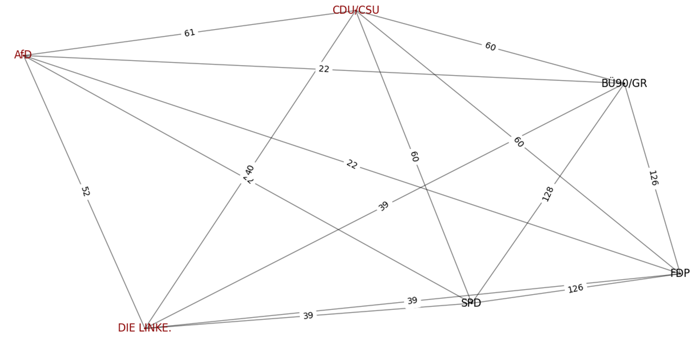

# Die namentlichen Abstimmungen des Bundestag als Netzwerk.

Diese Python-Anwendung ermöglicht die Analyse und Visualisierung von (gewichteten) Netzwerken basierend auf den namentlichen Abstimmungen im Bundestag. Sie extrahiert Daten aus Excel-Dateien, generiert Graphen mit Hilfe von `networkx` und analysiert die Netzwerkstruktur. Die Abstimmungen kann man unter [https://www.bundestag.de/parlament/plenum/abstimmung/liste](https://www.bundestag.de/parlament/plenum/abstimmung/liste) downloaden; derzeit liegen die Abstimmungen der 18. und 19. Legislaturperiode vollständig vor. Die Abstiimmungen der 20. Legislaturperiode isn nicht vollständig, da sie derziet noch läuft.

## Hauptfunktionen

- **Datendeserialisierung:** Laden von Abstimmungsdaten aus Excel-Dateien.
- **Netzwerkgenerierung:** Erstellung von Netzwerken basierend auf Abstimmungsmustern.
- **Analyse:** Berechnung von Netzwerkmetriken wie modularity.

## Voraussetzungen

Stellen Sie sicher, dass Sie Python 3.6 oder höher installiert haben und folgende Pakete installieren:

```bash
pip install pandas
pip install networkx
pip install openpyxl
```

## Schnellstart

1. **Daten vorbereiten:** Platzieren Sie Ihre `.xls` oder `.xlsx` Dateien im Verzeichnis `Abstimmungen/LP<Legislaturperiode>`. Derzeit liegen die namentlichen Abstimmungen des 18., 19. und 20. Legislaturperiode vor.
2. **Skript ausführen:** Eine exemplarische Nutzung ist im Skript `main.py` nachlesbar. Ein Abstimmungsnetzwerk kann wie folgt aussehen: Legislaturperiode 20; Stand: 14.03.2024.
   



## Lizenz

Dieses Projekt steht unter der MIT Lizenz. Details finden Sie in der `LICENSE` Datei.
